<p align="center">
  
  <br>
  <strong>把 AI 投研做成一支「财务部」——企业和个人都能用</strong>
  <br>
  <span>A vibe investing agent harness that turns market research into a persistent, auditable loop.</span>
  <br><br>
  
  <a href="https://github.com/langchain-ai/langchain"></a>
  
  
  
  
</p>

<p align="center">
  <strong>English</strong> ｜ <a href="docs/README.zh-CN.md">简体中文</a> ｜ <a href="docs/README.ja-JP.md">日本語</a>
</p>

<p align="center">
  <a href="#why-finhub">Why FinHub</a> &bull;
  <a href="#product-tour">Product Tour</a> &bull;
  <a href="#the-research-loop">Research Loop</a> &bull;
  <a href="#whats-inside">What's Inside</a> &bull;
  <a href="#getting-started">Getting Started</a> &bull;
  <a href="#how-it-works">How It Works</a> &bull;
  <a href="#system-architecture">Architecture</a>
</p>

<p align="center">
  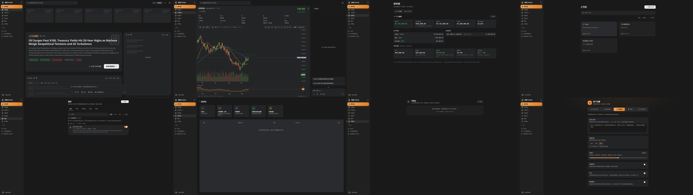
</p>
<p align="center"><em>Eight surfaces, one workspace. Pin a news brief → kick off idea generation → dispatch parallel subagents to screen the market → get calibrated long/short ideas back inline.</em></p>

<p align="center">
  <a href="screenshots/video/finhub-showcase.mp4">▶ Watch the 3.5-min product film ｜ 观看完整展示片</a>
</p>

---

## Why FinHub

Every AI finance tool today treats investing as **one-shot**: ask a question, get an answer, move on. But real investing is Bayesian — you start with a thesis, new data arrives daily, and you update your conviction over weeks and months. No single prompt captures that.

FinHub brings the insight from software engineering — *a codebase persists, and every commit builds on what came before* — to investing. Give the agent a **persistent workspace**, and research naturally compounds.

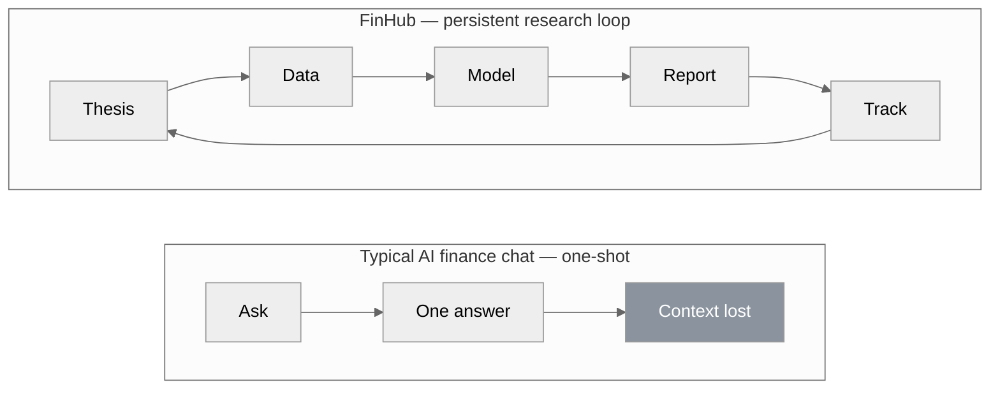
```mermaid
%%{init: {'theme': 'neutral'}}%%

flowchart LR
    subgraph Traditional ["Typical AI finance chat — one-shot"]
        direction LR
        Q["Ask"] --> A["One answer"] --> X["Context lost"]
    end

    subgraph FinHubL ["FinHub — persistent research loop"]
        direction LR
        T["Thesis"] --> D["Data"] --> M["Model"] --> R["Report"] --> Tr["Track"] --> T
    end

    style X fill:#8b949e,color:#fff
```

One workspace per research goal ("Q2 rebalance", "data center demand deep dive"). Interview the agent about your goals and style, get the first deliverable, and come back tomorrow — your files, threads, and accumulated research are still there. Every number traces to a source; every conclusion references *your* book.

## Product Tour

The real UI, not mockups. Each surface is a live screenshot (dark theme).

<table>
  <tr>
    <td width="50%">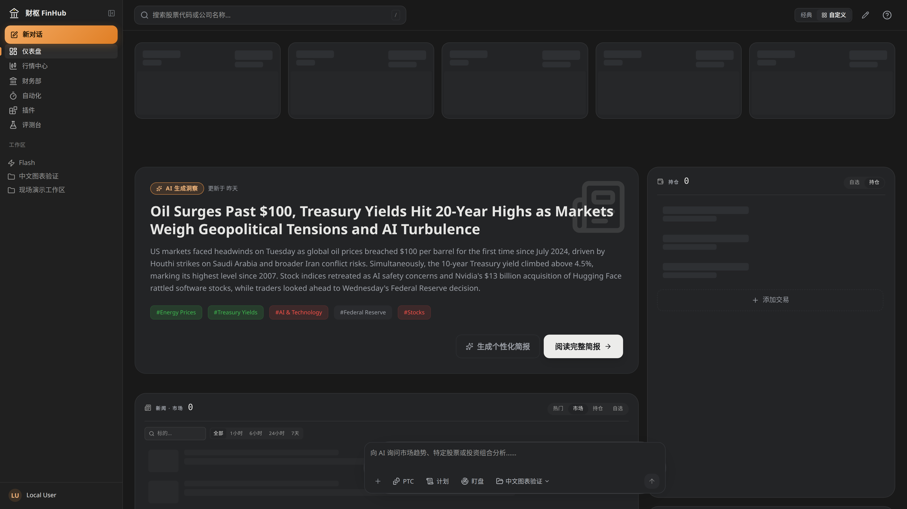</td>
    <td width="50%">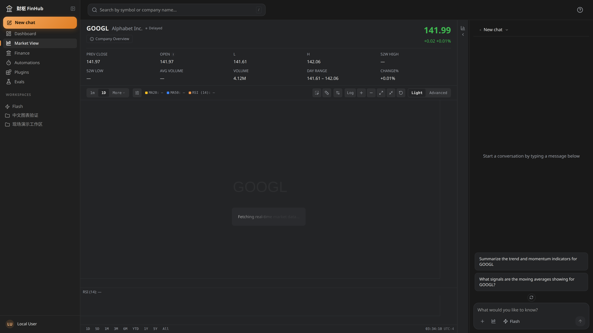</td>
  </tr>
  <tr>
    <td align="center"><em><strong>Dashboard</strong> — preset layouts (Morning Brief, Trader, Researcher) or a widget gallery; market strip, brief, watchlist.</em></td>
    <td align="center"><em><strong>MarketView</strong> — TradingView candles, live WebSocket ticks, agent-drawn annotations, multimodal capture.</em></td>
  </tr>
  <tr>
    <td width="50%">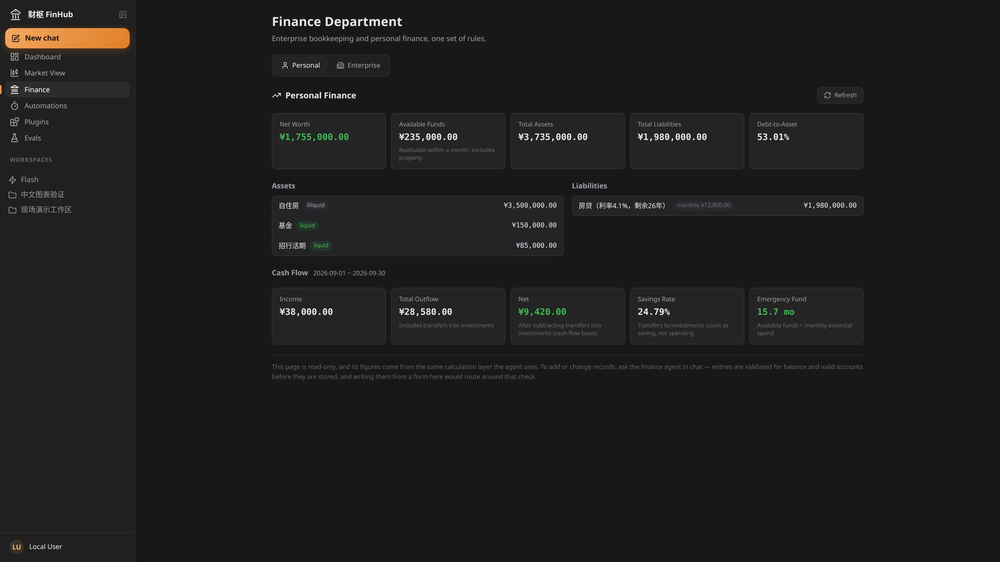</td>
    <td width="50%">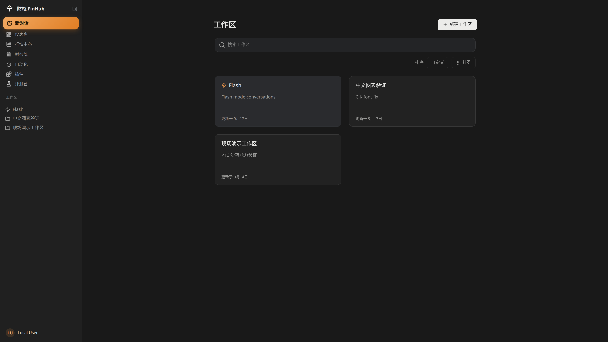</td>
  </tr>
  <tr>
    <td align="center"><em><strong>Finance</strong> — inline financial charts, multi-format file viewer, shareable threads.</em></td>
    <td align="center"><em><strong>Chat</strong> — inline HTML widgets, source-provenance panel, live subagent monitoring.</em></td>
  </tr>
  <tr>
    <td width="50%">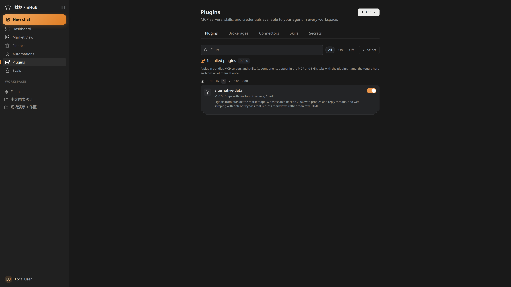</td>
    <td width="50%">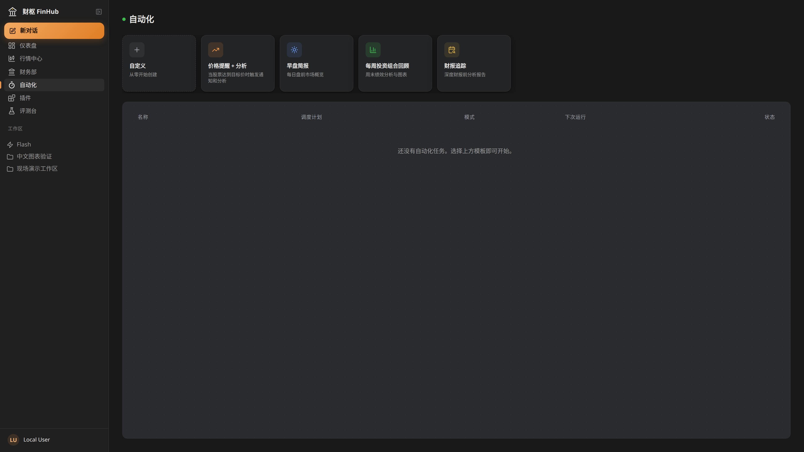</td>
  </tr>
  <tr>
    <td align="center"><em><strong>Plugins</strong> — MCP servers, skills, and provider config per workspace.</em></td>
    <td align="center"><em><strong>Automations</strong> — cron & price-triggered research with execution history.</em></td>
  </tr>
  <tr>
    <td width="50%">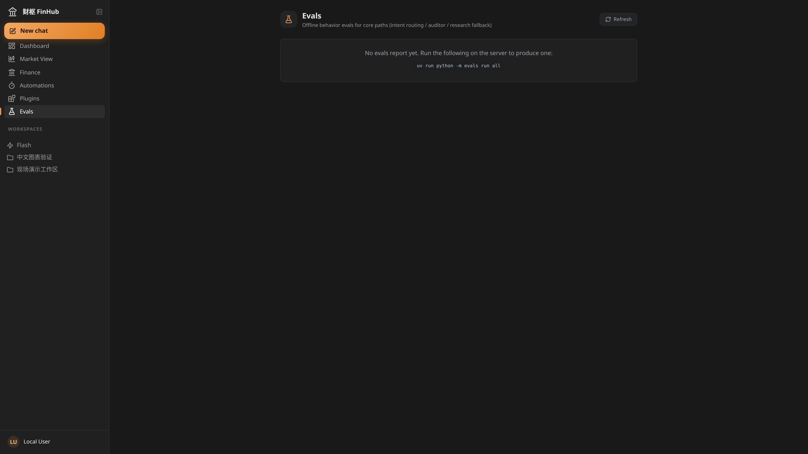</td>
    <td width="50%">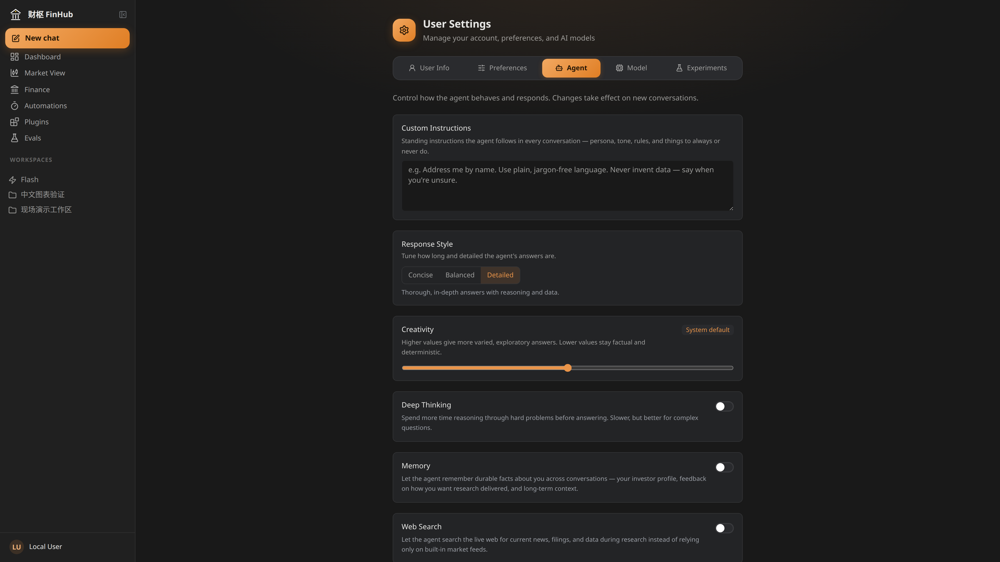</td>
  </tr>
  <tr>
    <td align="center"><em><strong>Evals</strong> — regression suites that grade agent research output.</em></td>
    <td align="center"><em><strong>Settings</strong> — user, model, and agent configuration in one place.</em></td>
  </tr>
  <tr>
    <td>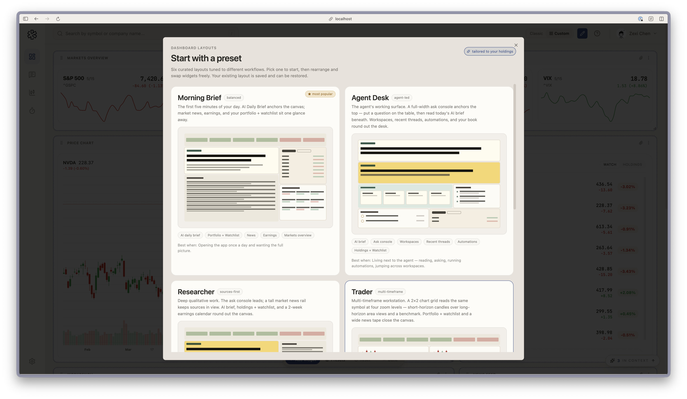</td>
    <td>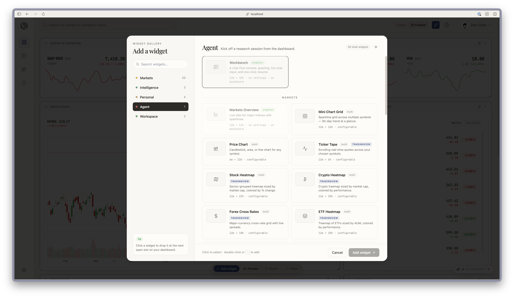</td>
  </tr>
  <tr>
    <td align="center"><em>Start from a curated preset — Morning Brief, Agent Desk, Researcher, or Trader…</em></td>
    <td align="center"><em>…or compose your own from the widget gallery — markets, intelligence, personal, agent, workspace.</em></td>
  </tr>
</table>

## The Research Loop

FinHub's core product line is a **research loop**, not a chatbot: **选题观点 → 数据采集 → 建模估值 → 报告产出 → 跟踪维护 → 触发再研究**. Every workspace runs on this loop, and each stage hands off to the next with evidence preserved:

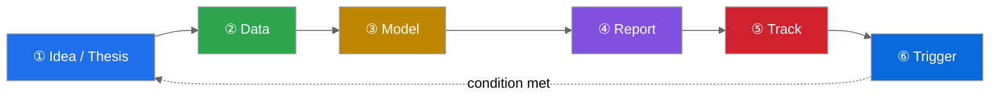
```mermaid
%%{init: {'theme': 'neutral'}}%%

flowchart LR
    A["① Idea / Thesis"] --> B["② Data"]
    B --> C["③ Model"]
    C --> D["④ Report"]
    D --> E["⑤ Track"]
    E --> F["⑥ Trigger"]
    F -. "condition met" .-> A

    style A fill:#1f6feb,color:#fff
    style B fill:#2da44e,color:#fff
    style C fill:#bf8700,color:#fff
    style D fill:#8250df,color:#fff
    style E fill:#cf222e,color:#fff
    style F fill:#0969da,color:#fff
```

1. **Idea / Thesis** — a falsifiable thesis with pillars, risks, catalysts, and a target anchor.
2. **Data** — every number captured with its source, pull time, and caliber into an evidence snapshot.
3. **Model** — DCF / comps / three-statement models with explicit assumptions and sensitivity, run in the sandbox.
4. **Report** — coverage reports, earnings analysis, morning notes, dashboards — each gated by an `evidence-check` pass before delivery.
5. **Track** — thesis scorecards, catalyst calendars, and watchlist refreshes keep the thesis honest as facts move.
6. **Trigger** — cron or real-time price-triggered automations pull you back into the loop when conditions are met.

<p align="center">
  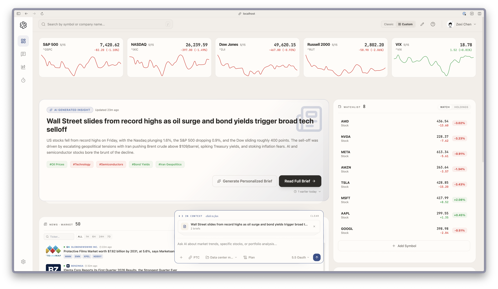
</p>
<p align="center"><em>Stage ① in one click — pin any dashboard tile (market brief, watchlist row) into the agent chat to kick off a research thread.</em></p>

The loop is **portfolio-aware** (conclusions reference your `portfolio.json` / `watchlist.json`), **re-runnable** (artifacts accumulate under stable names), and **auditable** (every number traces to a source).

## What's Inside

| Pillar | What you get |
| --- | --- |
| **Research loop** | 6-stage mainline with evidence preserved at every handoff; new workspaces start at stage ① |
| **PTC execution** | Agent writes & runs Python in a sandbox — only final results return to context, not raw data dumps |
| **Persistent workspace** | `agent.md` notes + long-term memory + user memo store compound research across sessions and threads |
| **Data ecosystem** | 3-tier provider fallback, 9+ MCP servers, native quick-lookup tools, per-workspace MCP config |
| **Two agent modes** | **PTC mode** for deep multi-step research; **Flash mode** for fast chat & orchestration (secretary) |
| **Skills** | 25 pre-built financial research skills, activatable by slash command or auto-detection |
| **Agent swarm** | Parallel async subagents with isolated contexts, mid-run steering, and checkpoint resume |
| **Workbench UI** | Configurable dashboard, TradingView, inline charts & widgets, file viewer, sharing, provenance panel |
| **Automations** | Cron & price-triggered runs that pull you back into the loop |
| **Enterprise team** | Finance-department subagents: accountant, treasury, tax, FP&A, internal auditor |
| **Security** | Encryption at rest (pgcrypto), credential-leak redaction, sandboxed execution, per-workspace vault |
| **Channels** | Slack, Discord, Feishu, Telegram + email delivery; SSE reconnect replay (150K events) |

## Getting Started

Start with **nothing but Docker** — no data API keys, no cloud sandbox. Just Docker and your own LLM subscription.

```bash
git clone https://gitcode.com/badhope/FinHub.git
cd FinHub
make config   # interactive wizard — creates .env, configures LLM, data sources, sandbox, and search
make up       # starts PostgreSQL, Redis, backend, and frontend
```

- **Frontend:** [http://localhost:5173](http://localhost:5173) · **API:** [http://localhost:8000](http://localhost:8000) (docs at `/docs`) · **Verify:** `curl http://localhost:8000/health`

Optional keys unlock more — add via the wizard or `.env` later:

| Key | What It Unlocks |
| ------------------------------------ | ----------------------------------------------------------------------------------------------------------------------- |
| `DAYTONA_API_KEY` | Persistent cloud sandboxes with cross-session workspace support ([daytona.io](https://www.daytona.io/)) |
| `FMP_API_KEY` | High-quality fundamentals, macro, SEC filings, options ([free tier available](https://site.financialmodelingprep.com/)) |
| `SERPER_API_KEY`, `TAVILY_API_KEY`, `EXA_API_KEY`, or `PARALLEL_API_KEY` | Web search (any one enables it) |
| `FIRECRAWL_API_KEY` | Upgraded web fetch and site crawling (the built-in crawler needs no key) |
| `LANGSMITH_API_KEY` / `OTEL_EXPORTER_OTLP_ENDPOINT` | LangSmith tracing / OpenTelemetry to any OTLP backend |

> [!NOTE]
> Without external keys you get a functional but reduced experience: Yahoo Finance covers price history and basic fundamentals (no real-time ticks or options), and the Docker sandbox replaces Daytona with full PTC support but weaker isolation. Add keys incrementally. `make help` lists all commands; manual setup without Docker lives in [CONTRIBUTING.md](CONTRIBUTING.md#quick-start); platform caveats (e.g. Windows Redis >= 5) are documented inline in [.env.example](.env.example).

## How It Works

### Programmatic Tool Calling (PTC)

Most agents dump raw tool output into the LLM context window. **PTC flips this**: the agent writes Python that runs inside a [Daytona](https://www.daytona.io/) cloud sandbox, processes data locally, and returns only the final result — slashing token waste while enabling analysis that would otherwise exceed context limits.

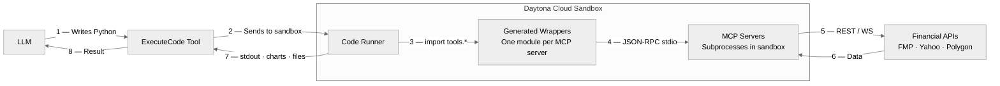
```mermaid
%%{init: {'theme': 'neutral'}}%%

flowchart LR
    LLM["LLM"] -- "1 — Writes Python" --> EC["ExecuteCode Tool"]
    EC -- "2 — Sends to sandbox" --> Run["Code Runner"]

    subgraph Sandbox ["Daytona Cloud Sandbox"]
        Run -- "3 — import tools.*" --> Wrappers["Generated Wrappers<br/>One module per MCP server"]
        Wrappers -- "4 — JSON-RPC stdio" --> MCP["MCP Servers<br/>Subprocesses in sandbox"]
    end

    MCP -- "5 — REST / WS" --> APIs["Financial APIs<br/>FMP · Yahoo · Polygon"]
    APIs -- "6 — Data" --> MCP
    Run -- "7 — stdout · charts · files" --> EC
    EC -- "8 — Result" --> LLM
```

<p align="center">
  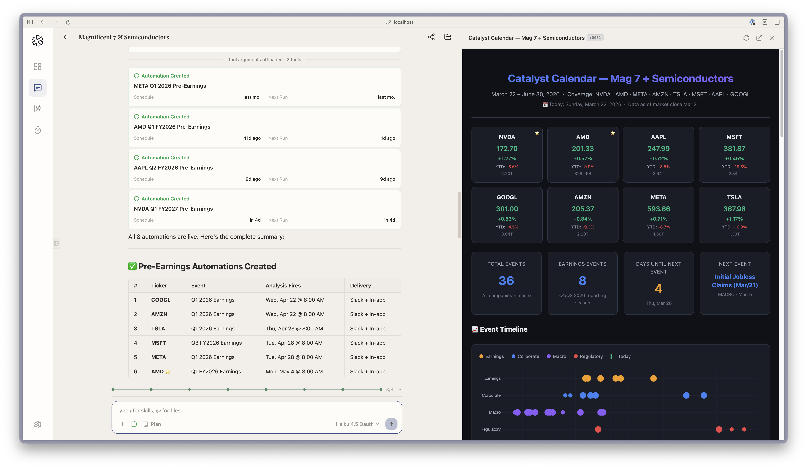
</p>
<p align="center"><em>The agent writes code to build interactive dashboards — here, a Mag 7 + Semiconductors catalyst calendar.</em></p>

### Persistent Workspace

Each workspace maps to a dedicated sandbox with a structured layout, so intermediate results survive across sessions:

```text
workspace/
├── agent.md                # agent's running notes — goals, key findings, thread & file index
├── work/<task>/            # per-task scratch area: data, charts, code
├── results/                # finalized reports (HTML · PDF · XLSX …)
├── data/                   # shared datasets reused across tasks
└── .agents/
    ├── user/memory/        # long-term memory — durable preferences, survives workspace resets
    └── user/memo/          # your uploaded PDFs & notes, text-extracted and citable by topic
```

`agent.md` is injected into every model call, so the agent always has full context of prior work without re-reading files. Each workspace supports multiple conversation threads tied to one research goal.

<p align="center">
  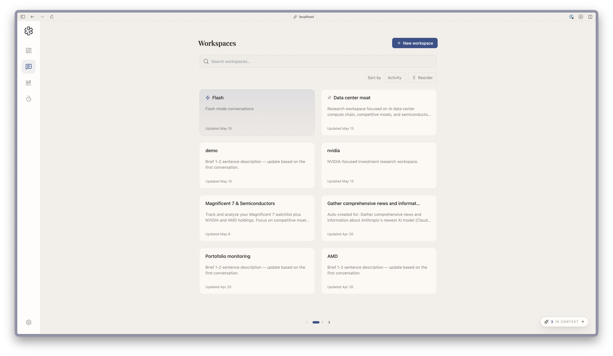
</p>
<p align="center"><em>Each workspace maps to a persistent sandbox — organize research by theme, portfolio, or thesis.</em></p>

**Bring your own model** — PTC and Flash modes run on a provider-agnostic layer with automatic failover. Connect ChatGPT or Claude via OAuth, use coding plans (Kimi, GLM, MiniMax, Doubao), or bring API keys for OpenAI, Anthropic, Gemini, DeepSeek, Qwen, Groq, Ollama, vLLM and more via BYOK. All keys are encrypted at rest (see [Security](#security--workspace-vault)).

### Financial Data Ecosystem

Quick lookups go through **native tools** (company overview, SEC filings, indices, sector performance, web search/fetch) whose results render as artifacts directly in the UI. Bulk work — multi-year statements, charting, screening — goes through **MCP servers** (price data, fundamentals, macro, options, Yahoo suite, X/Twitter, scraping) consumed via PTC. The agent picks the right layer automatically.

#### Data Provider Fallback Chain

Data flows through a **three-tier fallback chain** — each tier is optional, and the system degrades gracefully:

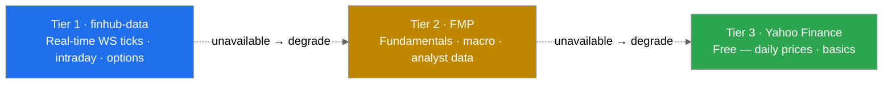
```mermaid
%%{init: {'theme': 'neutral'}}%%

flowchart LR
    T1["Tier 1 · finhub-data<br/>Real-time WS ticks · intraday · options"]
    T2["Tier 2 · FMP<br/>Fundamentals · macro · analyst data"]
    T3["Tier 3 · Yahoo Finance<br/>Free — daily prices · basics"]

    T1 -. "unavailable → degrade" .-> T2 -. "unavailable → degrade" .-> T3

    style T1 fill:#1f6feb,color:#fff
    style T2 fill:#bf8700,color:#fff
    style T3 fill:#2da44e,color:#fff
```

> [!NOTE]
> Yahoo Finance (tier 3) is community-sourced: no intraday below 1-hour intervals, delayed quotes, occasional rate limits. An `FMP_API_KEY` is strongly recommended ([free tier available](https://site.financialmodelingprep.com/)). Run free-only via `make config`.

### Financial Research Skills

25 pre-built skills, activatable by slash command or auto-detection. Follows the [Agent Skills Spec](https://agentskills.io/specification) — extend by dropping a `SKILL.md` into the workspace.

| Category | Skills |
| ------------------------ | ----------------------------------------------------------------------------------------- |
| **Research Loop** | Research Loop (6-stage mainline), Evidence Check (number credibility gate) |
| **Valuation & Modeling** | DCF Model, Comps Analysis, 3-Statement Model, Model Update, Model Audit |
| **Equity Research** | Initiating Coverage (30–50pg report), Earnings Preview, Earnings Analysis, Thesis Tracker |
| **Market Intelligence** | Morning Note, Catalyst Calendar, Sector Overview, Competitive Analysis, Idea Generation, X Research |
| **Document Generation** | PDF, DOCX, PPTX, XLSX, HTML — create, edit, extract |
| **Operations** | Investment Deck QC, Scheduled Automations, User Profile & Portfolio |

Acknowledgement: some skills are adapted from [anthropics/financial-services-plugins](https://github.com/anthropics/financial-services-plugins).

<p align="center">
  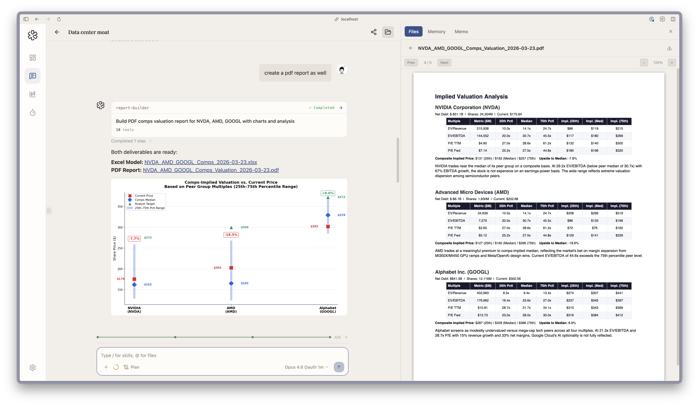
</p>
<p align="center"><em>The Comps Analysis skill ships an Excel model and a PDF report — with implied price ranges from peer-group multiples.</em></p>

### Multimodal & Chart Annotations

The agent natively reads images and PDFs (intercepted file reads injected as base64). In MarketView, your live candlestick chart is captured with structured metadata (symbol, interval, OHLCV, MAs, RSI, 52-week range) so the agent reasons about both the visual pattern and the underlying data. Ask it to mark up the chart and it draws **directly on the canvas** — price levels, trendlines, Fibonacci retracements, event badges — streamed over SSE and persisted per `symbol:timeframe`.

<p align="center">
  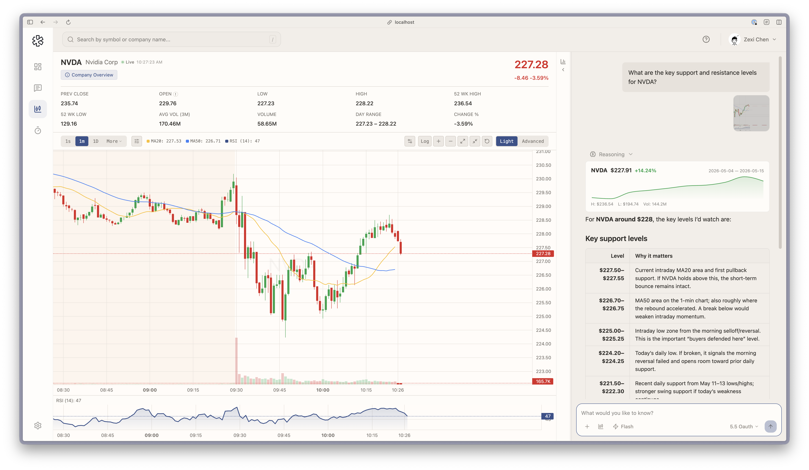
</p>
<p align="center"><em>MarketView sends the live chart to the agent for real-time technical analysis.</em></p>

### Automations

Schedule from within a conversation or manage on the Automations page (full CRUD, execution history, manual trigger). **Time-based**: cron or one-shot datetime. **Price-triggered**: fire when a stock or index crosses a price or percent-move condition (AND-combinable, one-shot or recurring with cooldown) — powered by a real-time WebSocket feed with Redis deduplication across instances.

<p align="center">
  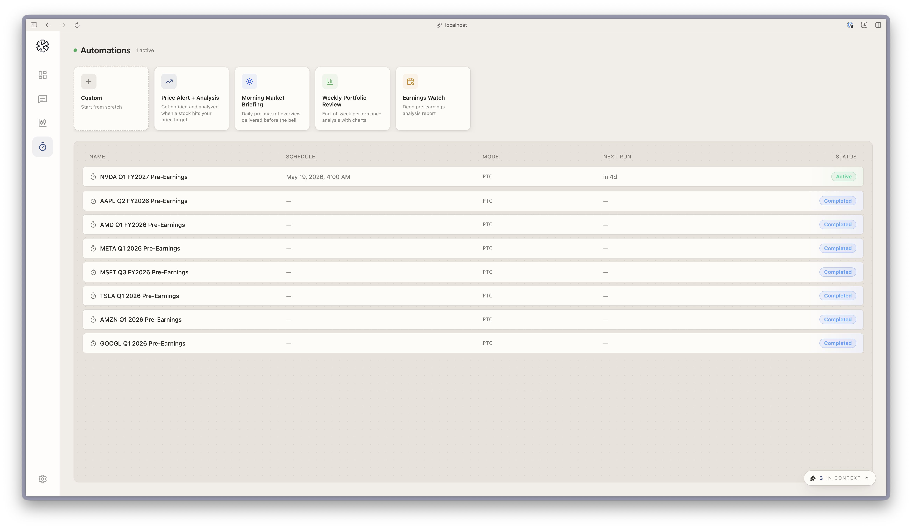
</p>
<p align="center"><em>Schedule recurring research — here, Mag 7 pre-earnings analyses run automatically ahead of each report.</em></p>

> [!NOTE]
> Price-triggered automations require a real-time WebSocket feed (`FINHUB_DATA_URL`). Broader WebSocket source support is planned.

### Agent Swarm

The core agent runs on [LangGraph](https://github.com/langchain-ai/langgraph) and spawns **parallel async subagents** via a `Task()` tool — isolated context windows keep long reasoning chains from drifting; synthesized results return to a lean orchestrator. The main agent can steer a running subagent mid-flight or resume a completed one with full context; on restart, state is rebuilt from the last checkpoint. Watch progress live in the **Subagents** view.

<p align="center">
  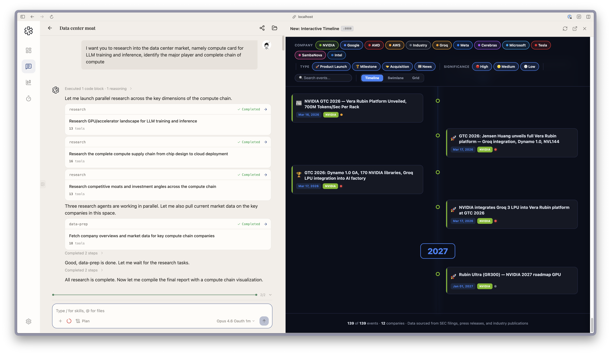
</p>
<p align="center"><em>Research subagents run in parallel across the compute chain — results merge into an interactive AI compute timeline.</em></p>

## System Architecture

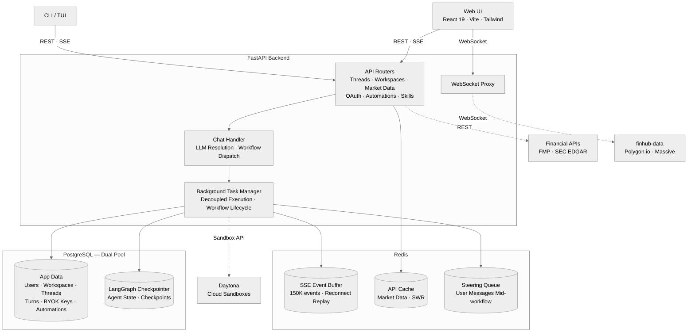
```mermaid
%%{init: {'theme': 'neutral'}}%%

flowchart TB
    Web["Web UI<br/>React 19 · Vite · Tailwind"] -- "REST · SSE" --> API
    Web -- "WebSocket" --> WSP
    CLI["CLI / TUI"] -- "REST · SSE" --> API

    subgraph Server ["FastAPI Backend"]
        API["API Routers<br/>Threads · Workspaces · Market Data<br/>OAuth · Automations · Skills"]
        WSP["WebSocket Proxy"]
        API --> ChatHandler["Chat Handler<br/>LLM Resolution · Workflow Dispatch"]
        ChatHandler --> BTM["Background Task Manager<br/>Decoupled Execution · Workflow Lifecycle"]
    end

    subgraph PostgreSQL ["PostgreSQL — Dual Pool"]
        AppPool[("App Data<br/>Users · Workspaces · Threads<br/>Turns · BYOK Keys · Automations")]
        CheckPool[("LangGraph Checkpointer<br/>Agent State · Checkpoints")]
    end

    subgraph Redis ["Redis"]
        EventBuf[("SSE Event Buffer<br/>150K events · Reconnect Replay")]
        DataCache[("API Cache<br/>Market Data · SWR")]
        Steering[("Steering Queue<br/>User Messages Mid-workflow")]
    end

    BTM --> AppPool
    BTM --> CheckPool
    BTM --> EventBuf
    BTM --> Steering
    API --> DataCache

    BTM -. "Sandbox API" .-> Daytona["Daytona<br/>Cloud Sandboxes"]
    API -. "REST" .-> FinAPIs["Financial APIs<br/>FMP · SEC EDGAR"]
    WSP -. "WebSocket" .-> GData["finhub-data<br/>Polygon.io · Massive"]
```

Everything the agent does streams over SSE and runs as a background task decoupled from the HTTP connection — close the tab and the work continues; on reconnect, up to 150K buffered events replay. PostgreSQL persists agent state (LangGraph checkpoints) and user data; Redis buffers events and caches market data. A provenance middleware traces every external source the agent touches (web, SEC, market data, MCP, files) and surfaces it in a per-turn Sources panel — none of it enters the LLM context.

## Security & Workspace Vault

- **Encryption at rest** — BYOK keys, OAuth tokens, and vault secrets are encrypted in PostgreSQL via `pgcrypto`; plaintext is never stored.
- **Credential-leak redaction** — every tool output is scanned before reaching the LLM or the client; known secret values are redacted as `[REDACTED:KEY_NAME]`.
- **Sandboxed execution** — each workspace runs in its own sandbox with a dedicated filesystem and network boundary; protected-path guards block internal directories on both tool input and output.
- **Workspace vault** — store API keys once in the UI; every agent session in that workspace can use them via a simple Python API. Only the workspace owner can manage secrets.

```python
from vault import get, list_names, load_env

api_key = get("MY_API_KEY")       # retrieve a single secret
names = list_names()               # list available secret names
load_env()                         # bulk-load all secrets as env vars
```

## Channel Integrations

Use FinHub from the tools you already work in — the gateway relays messages between platforms and the core agent, with responses in each platform's native format.

| Feature | Slack | Discord | Feishu | Telegram | WhatsApp |
| ------------------------------ | ----- | ------- | ------ | -------- | -------- |
| Rich text / markdown | ✅ | ✅ | ✅ | ✅ | 🔜 |
| File upload (user → agent) | ✅ | ✅ | ✅ | ❌ | ➖ |
| File download (agent → user) | ✅ | ✅ | ✅ | ❌ | ➖ |
| Image rendering | ✅ | ✅ | ✅ | ❌ | ➖ |
| Human-in-the-loop interrupts | ✅ | ✅ | ✅ | ⚠️ | ➖ |
| Subagent tracking | ✅ | ✅ | ✅ | ✅ | 🔜 |
| Workspace / model selection | ✅ | ✅ | ✅ | ✅ | 🔜 |
| Automation delivery (outbound) | ✅ | ✅ | ❌ | ➖ | ➖ |
| Simplified account linking | ✅ | ✅ | ❌ | ❌ | ➖ |
| Slash commands | ✅ | ✅ | ✅ | ✅ | ➖ |

Slack and Discord map native channels/threads to workspaces and threads. Feishu ships full messaging with card-based UI (OAuth soon); Telegram is partial with full coverage coming; WhatsApp is planned.

## Documentation

- **API Reference** — interactive docs from the running server (`http://localhost:8000/docs`)
- **Localized README** — [简体中文](docs/README.zh-CN.md) · [日本語](docs/README.ja-JP.md)

## Contact

For questions, feature requests, or bug reports, please open an issue in the FinHub repository.

## Disclaimer

FinHub is a research tool, not a financial advisor. Nothing produced by this software constitutes investment advice, a recommendation, or a solicitation to buy or sell any security. All output is for informational and educational purposes only. Use at your own discretion — always do your own due diligence before making investment decisions.

## License

Apache License 2.0
